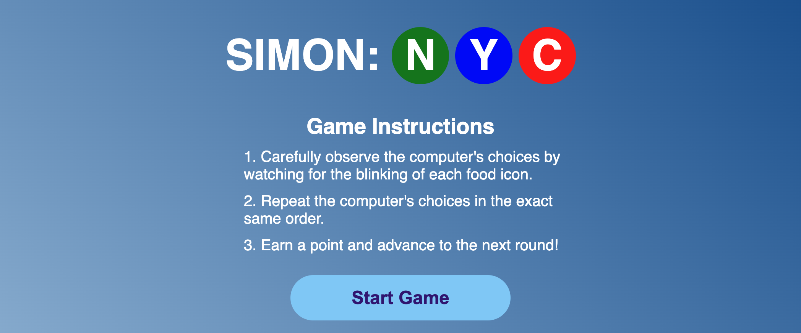
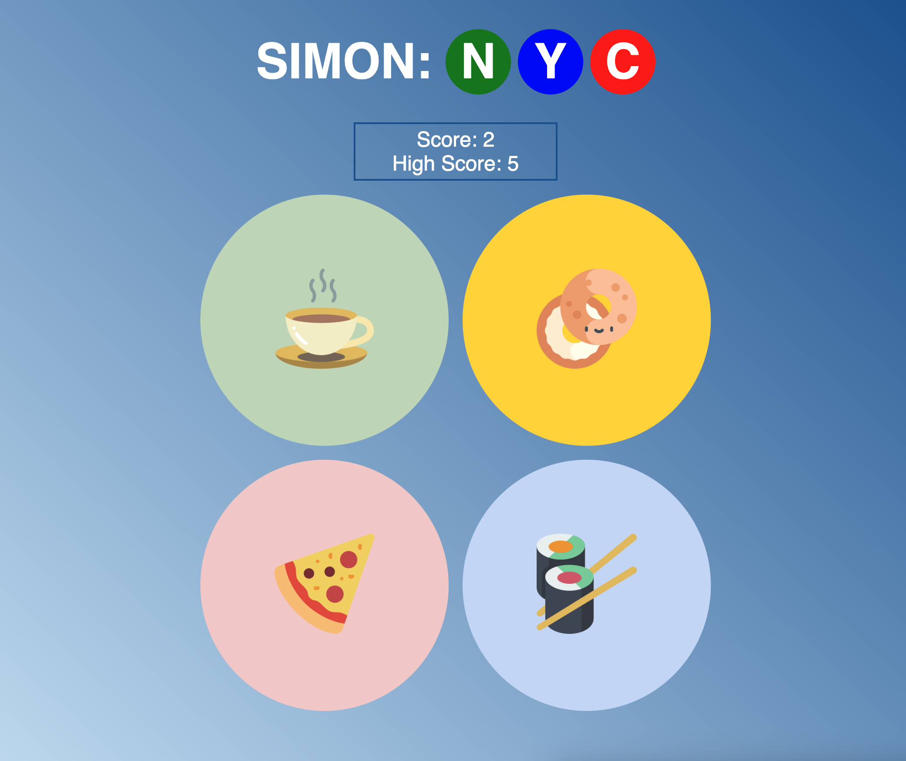

# 🗽 SIMON: NYC 🗽 
I chose to build the classic short-term memory game, 'Simon'. I recently moved to New York City, so I have chosen to replace the classic green, red, blue, and yellow colored buttons with some of the city's most notorious indulgences: coffee ☕️, bagels 🥯, pizza 🍕, and sushi 🍣!

## The Objective
The goal of the game is to repeat the exact sequence of choices the computer makes. As you progress to the next round, the computer will add on one additional choice to their exisiting sequence.

## How-To-Play
- Once you click 'Start Game', a 5-second countdown will begin. Once it reaches 0, the game officially begins with the computer's first choice.
- The computer's choices will be indicated by a brief change in the circle's color state. For example, they could choose 'sushi' (the circle would turn blue).
- Each turn, repeat the computer's choices in the exact order you remember them. If you choose the order correctly, you will earn a point and advance to the next round.
- If you do not match the computer's exact sequence, GAME OVER!

## Screenshots
You'll first see some brief instructions, followed by a 'Start Game' button that will start the countdown...

The countdown will start at 5 seconds. Once it's complete, the computer will make their first move!

Below is an example of the computer selecting bagel (notice the yellow circle!) Do you have what it takes to set a high score?

Make a mistake, forget the sequence, or just got distracted? Don't worry, you can try again!

## Technologies Used
- HTML
- CSS
- JavaScript

## Getting Started
▶️ <a href="https://zachkurfirst.github.io/project-1-simon-nyc/" target="_blank">Play SIMON: NYC</a>

### Tips while playing...
- The computer will begin each turn by repeating their previous choices. Then, they'll add one new, random choice - so look out for that repetition!
- This is a memory game. Pay very close attention to the computer's choices.
- Your click state is disabled (intentionally) until it's your turn. With that in mind, be patient with your first choice on each turn. If you click too quickly after the computer finishes, the click may not be registered.
- Your turn is not timed! Once the computer finishes their turn, take your time, no need to rush through your choices!

## Icebox Features
Features to consider for future updates...
- Audio on countdown, both computer and player choices, and game over
- Improved mobile click response to improve user experience
- Improved timing/duration on the enabling/disabling of the player click handler (see point 2 above in 'Tips while playing...' section)