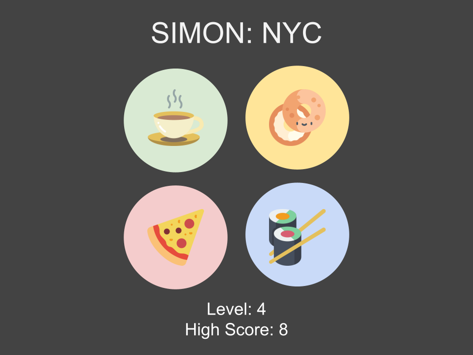

## Choice of Game
I am choosing to build 'Simon', a short-term memory game. I recently moved to New York City, so I have chosen to replace the classic green, red, blue, and yellow colored buttons with some of the city's most notorious indulgences: coffee, bagels, pizza, and sushi.

## Wireframe

## Pseudocode

## User Stories
1. As a player, I would like to first see the Computer's choice.
2. As a player, I would like to make my choice.
3. As a player, I would like to know if I'm correct by seeing me advance to the next level.
4. As a player, I would like to know when I've lost and the game is over.
5. (ICEBOX) As a player, I'd like audio to be added to each of the 4 choice buttons.
6. (ICEBOX) As a player, I'd like for there to be a button where I can read up on game rules/instructions.

## Game Logic

#### The Objective
The goal of the game is to repeat the exact sequence of choices the computer makes. As you progress to the next round, the computer will add on one additional choice to their exisiting sequence.

#### 1. Computer Turn
The game begins with the computer making it's first choice. For example, the computer could select 'pizza'.

#### 2. Player Turn
Next, the player is required to match the computer's choice in order for the game to continue.

#### 3. Correct Guess
If the player correctly repeats the computer's choice, they earn a point and the game continues to the next round.

After each correct guess, the player advances to the next level, and the level count increases by 1.

The computer would then make it's second choice. Each computer turn involves first repeating the exact sequence of their previous choices.

#### 4. Incorrect Guess
If the player guesses incorrectly, the game ends.

#### 5. High Score
The game will display the high score. If the player advances to a level greater than the current high score, the high score value will be updated.

